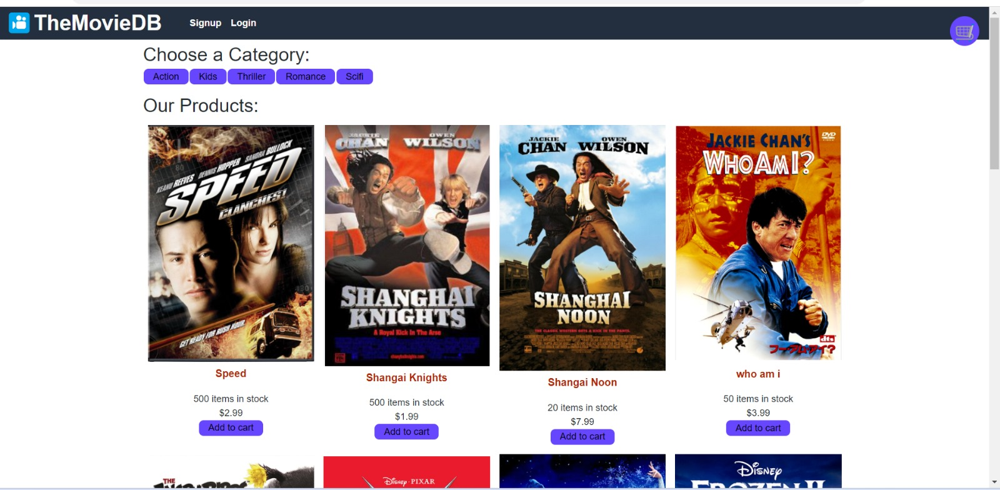
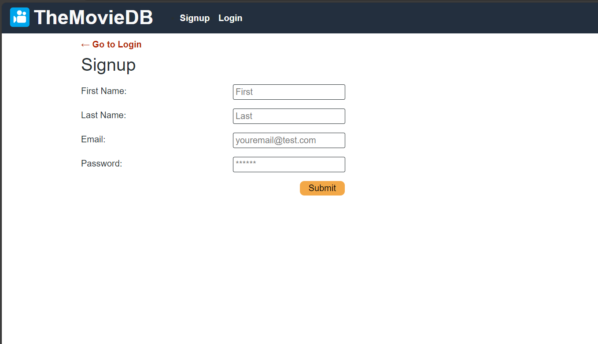
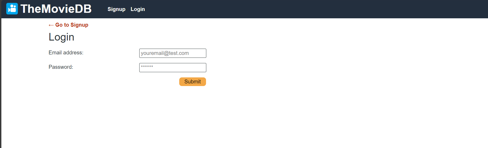
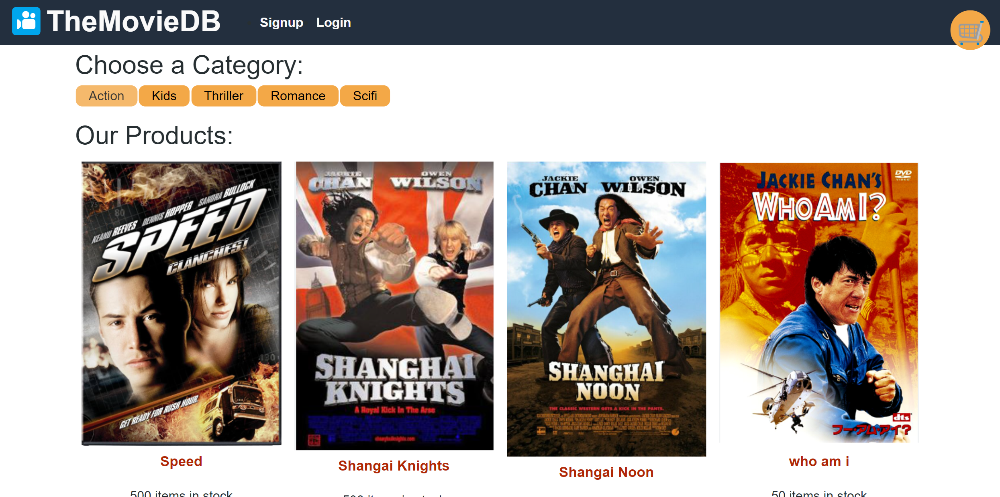
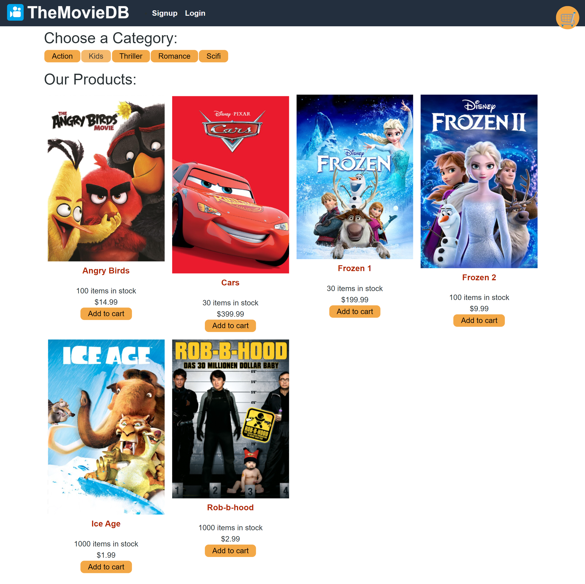
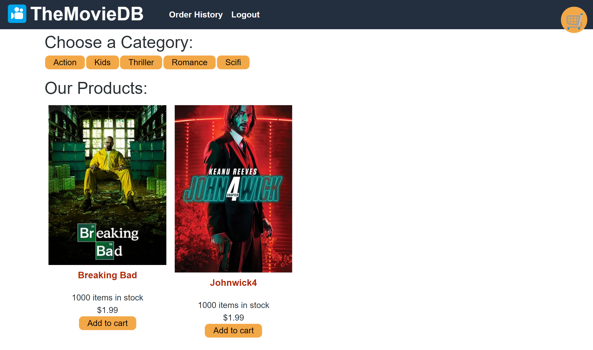
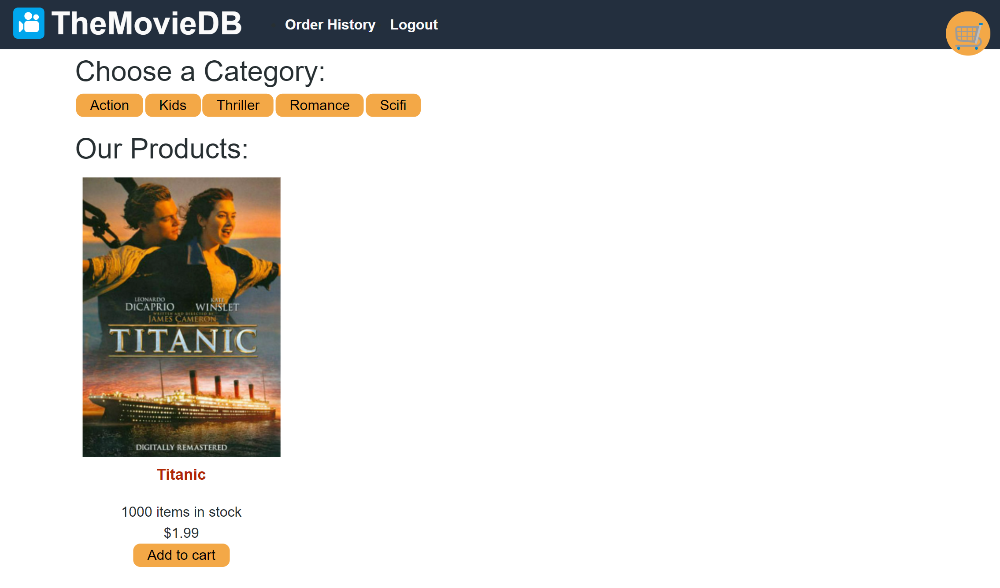
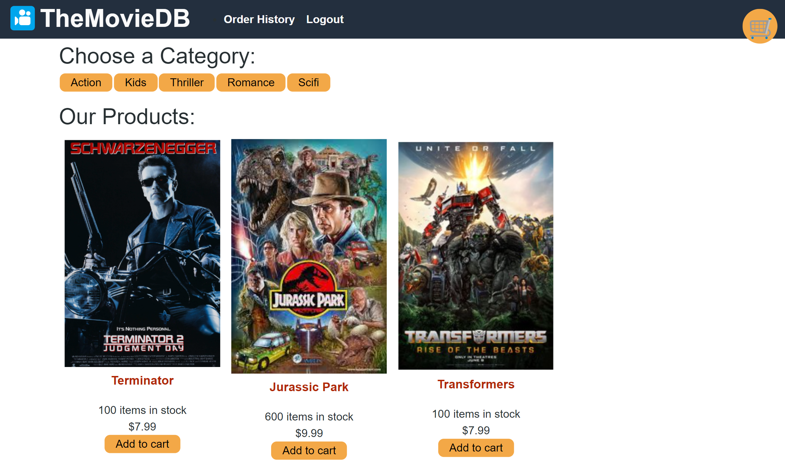

<div align="center">

# MovieDB_MERN

<p align="center">
    
    
    
    
    
    
    
    
    
</p>
 
</div>
# Description 
Introducing our comprehensive online movie database and e-commerce platform, where you can easily purchase your favorite films. Powered by the MERN Stack, our full-stack web application leverages the capabilities of React and Redux for a seamless user experience. With integrated Stripe payment processing, you can complete your transactions even in the event of a connection interruption. Additionally, our platform allows users to access their order history outside of the checkout process and offers convenient account creation and login functionalities. Explore, shop, and enjoy a hassle-free movie-buying experience with us.

 
The repository name is **MovieDB_MERN**

## Table of Contents

- [Technologies Used](#technologies-used)
- [Deployment](#deployment)
- [Usage](#usage)
- [References](#references)
- [License](#license)

## Technologies Used

- This application is a MERN stack application which is a group of four technologies, that is:-
  - MongoDB
  - Express.js
  - ReactJS
  - Node.js
- The MERN stack has a three-layer architecture based on Model-View-Controller pattern and each interconnected layer performs a specific function in the application:-

  | Client (View)          | React JS                   | User inputs data and Data display                        |
  | ---------------------- | -------------------------- | -------------------------------------------------------- |
  | **Server(Controller)** | **Express.js and Node.js** | **Method called to store and retrieve data in database** |
  | **Database(Model)**    | **MongoDB**                | **Stores raw data and contains no logic**                |

- As this application has come already with mostly pre-installed npm packages and is fully functioning Google Books API search engine built with a RESTful API and to refactor it to be a Graph API built with Apollo Server, the following additional npm packages were installed:-

        - npm i apollo-server-express
        - npm i graphql
        - npm i @apollo/client
        - npm i @apollo/react-hooks

* Before deploying to Heroku, the application is run in develop mode and tested using by entering at command prompt:-

  - npm install (ensure all that dependencies are installed)
  - npm init
  - npm run develop ( cd to the correct directory)

  

## Deployment

- The application has been deployed to Heroku with a MongoDB database using MongoDB Atlas.

- See the below the example of MongoDB database using MongoDB Atlas:-

  

- The URL of the functional deployed application is 

  ## Usage

Below are the screenshots of the walkthrough steps the user (the avid reader) who want to search for new books to so that the user can keep a list of books to purchase.

- As the user of the application :-

```

GIVEN a Movies DB engine
WHEN we load the engine
THEN we are presented with a menu with different categories of movies  and Login/Signup and Cart(where all movies to be purchased are added)

```

 

```
WHEN we click on the Login/Signup menu option
THEN a modal appears on the screen with a toggle between the option to log in or sign up
WHEN the toggle is set to Signup
THEN we are presented with three inputs for a username, an email address, and a password, and a signup button

```

 

```
WHEN the toggle is set to Login
THEN we are presented with two inputs for an email address and a password and login button

```
- 


```
WHEN we enter a valid email address and create a password and click on the signup button
THEN the respective user account is created and I am logged in to the site
THEN the menu options change categories of movies,ordered history, and Logout
THEN we can search the movies based on the catergories
```

 


```
THEN we are presented with five different Categories of movies 
Click on the desired categories 
Then we are presented with the movies belonging to that specific category
```

- Action Category

 


- Kids Category

 

- Thriller Category

 


- Romance Category



- Scienec-Fiction Category




```
When we press on the 'add to cart' the movies gets added to the cart
Then we are taken to the cart
Then we are proceeded to the checkout
Then we are presented to Card Information payment page 
THE purchased movies are can be seen in the ordered history

```


